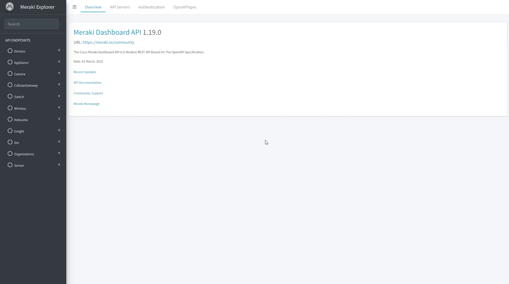

<h3 align="center">Meraki Explorer</h3>

<div align="center">

[]()
[](LICENSE.md)

</div>

---

<p align="center">
Meraki Explorer is a Web-application built on top of the OpenAPI specification that let you consume all available meraki API Endpoints 
    <br>
    <br>
</p>

- [Description](#description)
- [Categories and search](#categories)
- [Select Device/Network/Organization](#select)
- [Endpoint Response](#response)
- [JSON Body](#json_body)
- [Task Manager](#task_manager)
- [Rollback](#rollback)
- [OpenAPI spec](#openapi_spec)
- [Run the Web Application](#how_to_run)
- [Authors](#authors)

## Description <a name = "description"></a>

The main goal of Meraki Explorer is let you easly work with the meraki API endpoints even if you are not familiar with coding.
All you have to do is set your API key, the needed parameters and click submit!

The available enpoints are grupped in the left sidebar and can be searched based on endpoint name and description.

## Categories and search <a name = "categories"></a>

There are 4 main methods available:
GET/PUT/POST/DELETE

11 main categories:
Devices, Appliance, Camera, Cellulargateway, Switch, Wireless, Networks, Insight, Sm, Organizations, Sensor

Each available parameter is easily accessible with textbox or dropdown menus. The required parameters are marked by an asterix


## Select Device/Network/Organization <a name = "select"></a>

Based on category you can select one/many/all devices/network/organization to run the API against. Once selected, the respective parameter (e.g serial) will be automatically populated with the serial number of the devices selected. This allows you to run the API in a "loop" with just a click.


## Endpoint Response <a name = "response"></a>

The endopoint responses are available in table format or in JSON


## JSON Body <a name = "json_body"></a>

Parameters can be pasted in JSON format, the editor helps you to write a valid json payload to be sent by the endpoint


## Task Manager <a name="task_manager"></a>

The Task Manager utility stores each operation performed, the parameter used, the responses, and the status (success/fail). Here you can perform the Rollback (if available)

## Rollback <a name="rollback"></a>

Each PUT endpoint has an optional rollback feature available, this feature allows you to take a snapshot of the endpoint state before any change. Once the PUT operation is completeted, if needed, you can rollback to the previous state before the change.
Rollback operation are performed in Taskmanager and are available only for PUT operations


## OpenAPI spec <a name="openapi_spec"></a>

Meraki updates regularly the API endpoints, adding new endpoints or updating the old ones. You can download and use all the latest updated with just a click.

Meraki Dashboard API streaming live updates are available in this [Webex space](webexteams://im?space=bb5936e0-1b5f-11e9-a888-03e755b2f761)



## Run the Web Application <a name="how_to_run"></a>

Meraki Explorer runs in Docker 🐳 this small guide assumes you have a running Docker environement installed on your workstation. You can get Docker here => [Get Docker](https://docs.docker.com/get-docker/)

- clone this repository

```
git clone git@github.com:cyberdevnet/meraki-explorer.git
```

- change directory into meraki-explorer

```
cd meraki-explorer
```

- spin-up the docker containers

```
docker-compose -f dockersmeraki-explorer/docker-compose.yml up --build
```

Meraki explorer will be installed in 3 containers/microservices:

- meraki-explorer-mongodb (database)
- meraki-explorer-ngnix (front-end)
- meraki-explorer-fastapi (backend)

Once the applcation is running you can access it at http://localhost:81/

## ⛏️ Built With <a name = "tech_stack"></a>

- [MongoDB](https://www.mongodb.com/) - Database
- [FastAPI](https://fastapi.tiangolo.com/) - Server Framework
- [React](https://reactjs.org) - Web Framework

## ✍️ Authors <a name = "authors"></a>

- [@cyberdevnet](https://github.com/cyberdevnet)
